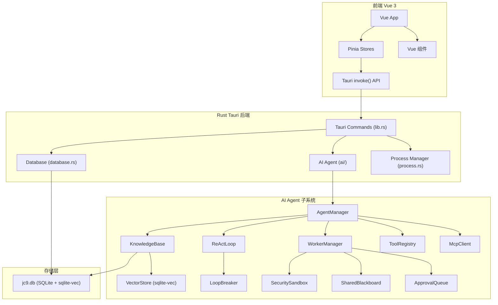

# JC9 架构总览

## 系统架构图



## 模块职责

| 模块 | 路径 | 一句话职责 |
|------|------|-----------|
| 数据库 | `database.rs` | SQLite 表管理，所有 CRUD 操作 |
| 进程管理 | `process.rs` | 终端进程创建、PTY 读写、进程生命周期 |
| AI 管理器 | `ai/agent_manager.rs` | 聚合所有 AI 子系统，生命周期管理 |
| LLM 提供者 | `ai/llm.rs` | OpenAI 兼容 API / Mock LLM |
| 工具注册表 | `ai/tools.rs` | Agent 可调用的工具注册和执行 |
| ReAct 循环 | `ai/react_loop.rs` | Thought → Action → Observation 推理闭环 |
| 知识库 | `ai/knowledge_base.rs` | 知识条目持久化 + TF-IDF 搜索 |
| 向量存储 | `ai/vector_store.rs` | sqlite-vec 语义搜索 / 余弦相似度回退 |
| Worker 管理 | `ai/worker_manager.rs` | 并发 Worker 调度、限流、生命周期 |
| Planner | `ai/planner.rs` | 任务分解（Mock/LLM 两种模式） |
| 审批队列 | `ai/approval.rs` | 高危操作聚合审批 + 超时熔断 |
| 黑板 | `ai/blackboard.rs` | Worker 间结构化数据共享 |
| 安全沙箱 | `ai/security.rs` | 路径校验、命令黑白名单、越界拦截 |
| 熔断器 | `ai/loop_breaker.rs` | 死循环检测 + 强制中断 |
| AST 解析 | `ai/ast_parser.rs` | Tree-sitter 符号提取 |
| 宿主检测 | `ai/host_detector.rs` | 环境采集 + 敏感变量脱敏 |
| 摘要器 | `ai/summarizer.rs` | 运行轨迹分析 + Takeaways 沉淀 |
| COW 工作区 | `ai/workspace.rs` | 隔离沙箱目录 + 三向合并 |
| 三向合并 | `ai/diff_merge.rs` | 行级 + 结构性冲突检测 |
| MCP 客户端 | `ai/mcp_client.rs` | MCP 协议通信（SSE + stdio） |
| 技能加载器 | `ai/skill_loader.rs` | 将 `.jc9/` 技能同步到知识库 |

## 数据流路径

### 用户操作流
```
用户点击 → Vue 组件 → Pinia store → invoke() → Tauri command → Rust 函数 → 返回结果 → UI 更新
```

### AI Agent 流
```
用户输入 → Planner 分解任务 → WorkerManager 分配 Worker
  → ReAct 循环 (思考→工具调用→观察→反思)
  → 工具执行 → 结果返回
  → Summarizer 总结 → Takeaways 沉淀到知识库
```

### 笔记同步流
```
用户保存笔记 → save_note command
  ├─ db.save_note()      → jc9.db.notes
  └─ kb.add_entry()      → jc9.db.knowledge
                              └→ embeddings (向量)
```

## 目录结构

```
src/                          ← 前端 Vue 3
  components/
    ai/AiAgentPanel.vue       ← AI Agent 面板（待开发）
    notes/                     ← 笔记系统
    tools/                     ← 工具箱
  stores/
    ai.ts                      ← AI Store
    notes.ts                   ← 笔记 Store
  types/
    ai.ts                      ← AI 类型定义

src-tauri/src/                 ← Rust 后端
  main.rs                      ← 入口
  lib.rs                       ← Tauri commands + 应用启动
  database.rs                  ← SQLite 数据库
  process.rs                   ← 终端进程
  ai/                          ← AI Agent 子系统（20 模块）
    mod.rs
    types.rs                   ← 核心类型
    *.rs                       ← 各模块
```
