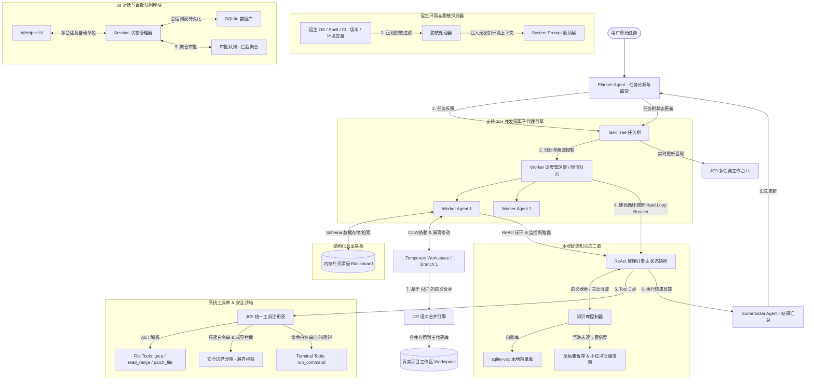
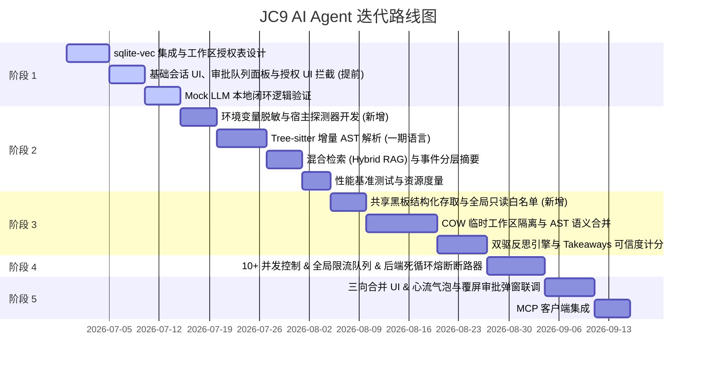

# JC9 AI Agent 深度集成方案 (完善版 - 融入工业级隐私与反死锁设计)

本方案旨在为 JC9（本地项目与终端管理器）规划一套具备“智能闭环能力”的 AI Agent 协同生态。结合最新的反馈，本版本补充了 **环境变量敏感信息脱敏**、**全局配置只读白名单**、**防弹窗轰炸的审批队列**、**Rust 后端死循环硬熔断拦截器** 以及 **结构化共享黑板数据 Schema**。这些工业级安全与交互设计，使得系统在保护用户隐私、维持流畅心流和应对高并发高压场景时具备极强的韧性。

---

## 💡 AI Coding Agent 的“智能核心”剖析

*   **“推理-行动-观察-自我修正”的闭环机制**：AI 通过“Thought -> Tool Call -> Observation -> Re-planning”的闭环，自主解决编译、构建、测试中的报错。
*   **精准的上下文召回与代码库表征**：利用轻量级 Tree-sitter 按需增量解析生成局部符号表，兼顾上下文召回精准度。
*   **精确编辑协议**：使用基于行范围的 `patch_file` 定位块精确替换，避免全文件重写并节省 Token。
*   **长期记忆与本地智能知识库的无缝融合**：通过本地智能知识库（SQLite + sqlite-vec）在开发时检索“避坑笔记”，增强 Agent 的本地生存与自愈能力。

---

## 🛠️ 完善后的 JC9 AI Agent 架构



---

## 📌 深度完善与工程优化设计方案

### 1. 宿主环境变量主动感知与正则脱敏 (Environment Perception & Sanitization)
*   **痛点**：全局环境变量中包含大量的敏感秘钥（如 `AWS_SECRET_ACCESS_KEY`、`NPM_TOKEN`、数据库密码等）。直接无损注入系统提示词会导致隐私严重泄露给第三方大模型服务商。
*   **脱敏机制**：
    1.  Tauri 后端在获取系统开发环境后，提取出环境变量快照。
    2.  对所有环境变量的键值对执行 **正则脱敏过滤（Sanitization Filter）**。
    3.  若 Key 包含 `PASSWORD`、`SECRET`、`TOKEN`、`KEY`、`PWD`、`AUTH` 等敏感字眼，系统自动将其 Value 替换为 `******`。
    4.  *脱敏后的 Prompt 注入示例*：
        ```json
        {
          "PATH": "/usr/bin:/bin:...",
          "NPM_TOKEN": "******",
          "AWS_SECRET_ACCESS_KEY": "******",
          "CUSTOM_DB_PASSWORD": "******",
          "PROJECT_ENV": "development"
        }
        ```
    5.  这既告知了 Agent 哪些必要的环境变量是存在且已加载的（防止其盲猜或尝试重设），又确保了真实的敏感私钥绝不离机。

### 2. 工作区只读白名单机制与越界拦截 (Out-of-bounds Read-only Whitelist)
*   **痛点**：开发流程中，Agent 极常需要读取项目外部的用户全局配置文件（如 `~/.gitconfig`、`~/.npmrc`、`~/.cargo/config.toml`）以获取包管理配置或 Git 身份信息。如果对任何越界读取都弹窗警告，会极度打断开发者的流畅心流。
*   **优化方案**：
    1.  在 `ToolsRegistry` 的路径校验模块中，硬编码维护一个 **全局只读白名单路径列表（Read-only Whitelist）**。
    2.  *白名单内容*：仅限于常见的、无代码危害的用户配置（如：`~/.gitconfig`、`~/.npmrc`、`~/.yarnrc`、`~/.cargo/config.toml`、`~/.ssh/config` 等）。
    3.  **只读直接放行**：当 Agent 发起对白名单路径的 **只读操作（Read-only）** 时，系统直接安全放行，不向用户弹出任何越界拦截提示。
    4.  **写入强拦截**：一旦 Agent 企图**修改或写入**白名单中的任何文件，或尝试读取白名单外的任何工作区外路径（如 `/etc/passwd` 等），直接硬性拦截并挂起任务，弹出“反重力”式覆屏卡片向用户确认授权。

### 3. 并发控制下的审批队列 (Approval Queue for Concurrency)
*   **痛点**：在 10+ 子代理并发执行时，多个 Worker 可能会在同一秒触发高危操作（越界修改、危险终端命令等）。如果在 UI 上直接弹出多个覆屏确认卡片，会导致严重的“弹窗轰炸”，引发前端卡死、多焦点冲突。
*   **队列机制**：
    1.  引入前端 **审批队列（Approval Queue）** 状态管理器。
    2.  当并发 Worker 触发拦截事件时，系统不生成独立弹窗，而是将请求推入 `ApprovalQueue`，前端只以一个**聚合的红点或顶部悬浮卡片提示**：“*AI 有 3 个敏感操作待您确认*”。
    3.  用户点击气泡提示后，展开一个整洁的 **“待审批列表面板”**。面板中列出每个 Worker 请求调用的工具详情、影响的文件 Diff、执行的命令。
    4.  用户可以逐条快速点击 `Approve` / `Deny`，甚至支持 `【一键全部拒绝 (Reject All)】`。极大地保证了高并发压力下客户端 UI 的稳定性与心流体验。

### 4. 外部强制死循环熔断器 (Hard Loop Breaker)
*   **痛点**：当 Agent 遇到未料及的错误时，可能由于上下文折叠、逻辑缺失或模型智商限制而陷入死循环（不断重试相同的失败命令）。此时 Agent 自身难以触发反思甚至会不断浪费 API Token。
*   **熔断断路器 (Loop Breaker)**：
    1.  在 Rust 后端的 `WorkerManager` 调度线程中，为每个 Worker 线程配备一个 **硬性死循环熔断监控器**。
    2.  如果某个 Worker 线程在未达成任务目标的前提下，**连续调用 Tool 超过 15 次**，或者**连续 3 次产生内容高度一致的报错 Observation**（通过字符对比与哈希校验）：
        *   **挂起并强行注入**：后端强行挂起该 Worker，在它的上下文最前端强行插入一条高优先级的系统级强制消息：
            > "【系统中断告警】：你已经连续 3 次遇到相同报错，当前思路存在死循环风险。请立即停止当前的命令重试，重新梳理黑板上的共享信息，更换其他替代工具或重构你的解题策略！"
        *   **彻底终止**：如果注入警告后，Worker 再次执行 5 轮依然报错或重复，后端将强行 Kill 该 Worker 线程，标记子任务失败并汇报给 Planner。

### 5. 共享黑板的数据结构规约 (Structured Blackboard Schema)
为了避免 Worker 写入杂乱的非结构化文本导致其他 Worker 无法解析，我们为 `SharedBlackboard` 存取的数据定义了严格的 JSON 结构：
*   **数据 Schema 规范**：
    ```json
    {
      "type": "global_config_path" | "dependency_resolved" | "env_variable" | "identified_bug",
      "key": "string",
      "value": "string",
      "source_worker": "string",
      "timestamp": "string (ISO 8601)"
    }
    ```
*   **示例数据**：
    *   *全局配置*：`{"type": "global_config_path", "key": "tsconfig.json", "value": "/path/to/tsconfig.json", "source_worker": "Worker-1"}`
    *   *已知 Bug*：`{"type": "identified_bug", "key": "src/services/api.ts", "value": "第45行存在隐式 NullPointerException 风险，已修改其接口声明", "source_worker": "Worker-3"}`
*   各 Worker 严格遵循此类目进行黑板读写，保证高并发下其他代理的快速、精准检索。

---

## 🔒 系统安全边界设计 (Security Boundaries)

### 1. 工具执行沙箱限制与“反重力”交互 🛡️
*   **“反重力”覆屏审批弹窗 (Overlay Card Dialog)**：当审批队列中出现挂起的敏感请求时，UI 使用半透明毛玻璃浮窗覆盖在 `AiHelper` 对话框正上方，提供 `Approve` / `Deny`，保持交互焦点的极度专注。
*   **白名单只读放行与 Canonical Path 越界硬防**：如上所述，提供全局配置文件只读白名单直接放行，其余项目外路径一律强越界拦截。

### 2. Token 成本防爆看板与熔断器
*   提供会话 Token 看板与预估美元消费，单次任务消费金额超过上限阈值（如 $0.5）自动暂停并熔断挂起。

---

## 📌 调整后的验证与迭代计划

*   **初期支持的语言范围（一期）**：优先支持 **TypeScript / Vue (Vite TS) / Rust**。


